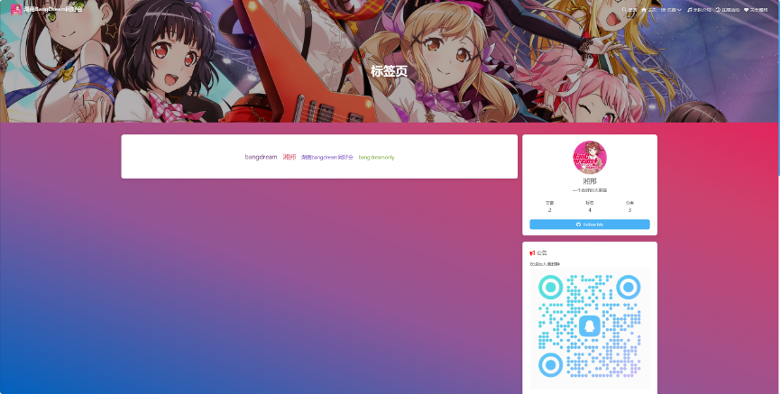
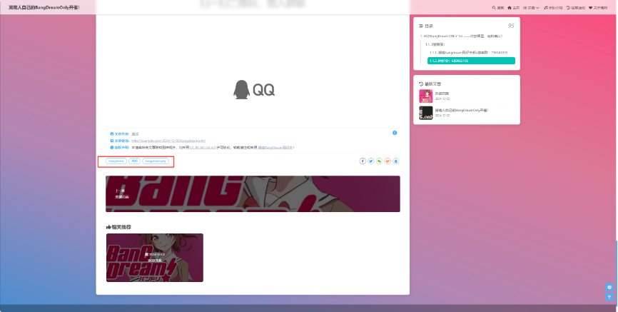
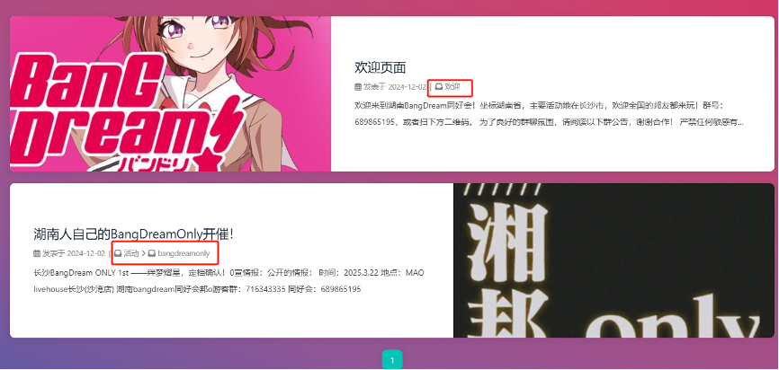
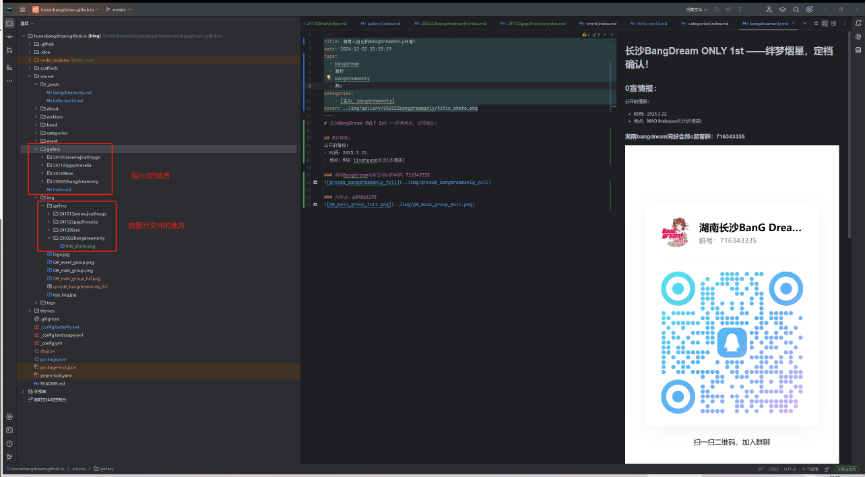
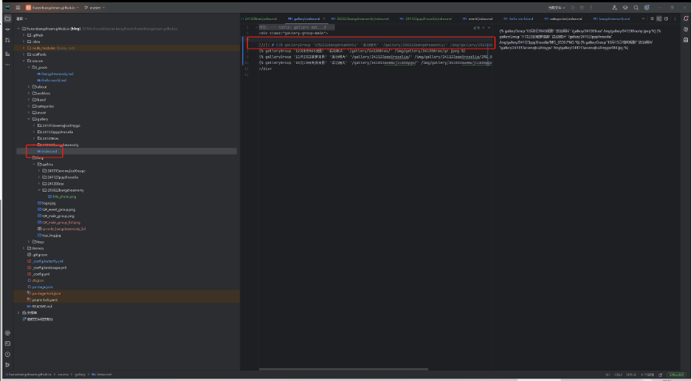

# 湘邦网页开发规范手册
V0.2版本：主要针对命名进行规范
## 网页入口
浏览器打开hunanbangdream.github.io
## 标签页面
标签通常是方便标签页面快速检索用的

每个博客下也有自己的标签

因此可以考虑的标签：1.如果某团的活动，在标签页面的团名都用英文的全称：

Poppin/’Party（P大写，中间是半角的单引号，没有空格） 
Roselia 
Afterglow 
Pastel/*Palettes（注意中间/*） 
Hello, Happy World!（所有符号都是半角，每个单词之间有空格） 
Mofornica 
RAISE A SUILEN（注意空格） 
MyGO!!!!!（注意最后五个半角感叹号） 
Ave Mujica 

本网站暂时不具备模糊搜索能力，所以必须统一表述（因此：博客标题也规定必须用全称）

仅规定在标签页面用英文全称，其他地方（比如：博客内容、相册标题等）均无需按此要求。

2.地区标签：添加具体地址，均采用简体汉字，对于海外地区采用最常见的翻译。

3.TODO
## 博客分类

是多级目录组成，通常一级目录表示博客的大概类型，二级目录是具体分类

可以考虑的一级目录：活动（或者线下活动）、注意事项、其他。但是感觉“活动”应该是最多的

可以考虑的二级目录：bangdreamonly、具体团的观影（比如ppp观影、pppXroselia对邦观影）

## 活动相册

标题采用：时间（年月日）+活动名称。比如11月23日的ppp和罗对邦，可以采用简写：241023pppXroselia。

活动相册是否展示是在gallery/index.md中，可以通过注释的方式屏蔽一些活动（比如未来还没开始的活动）

## 其他
TODO
